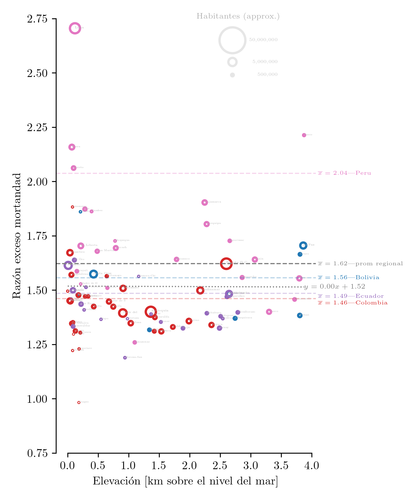

# Razón de mortandad vs elevación

## Descripción


```python
from IPython import display; display.Image("reg_alt_alt.png")
```


    

    


Razón de excesos de mortandad ($R_m$) vs elevación para regiones administrativas (nivel 1) de ciertos países de Latinoamérica. 
La línea base de mortandad (denominador) se tomó utilizando el año 2019. 
El numerador son los datos de mortandad disponibles desde marzo 2020. 
El área de cada circulo es proporcional a la población de la región.  
Las líneas discontinuas marcan el promedio ponderado para cada país (y para la región).
La línea punteada marca la regresión lineal (no ponderada) de la razón de mortandad (y) vs la elevación (x). 
La elevación de cada región se obtuvo mediante el promedio ponderado (por población) de sus ciudades constituyentes.

## Fuentes
datos de covid obtenidos del gran trabajo de:
  - https://github.com/pr0nstar
      - https://github.com/pr0nstar/covid19-data
        - https://github.com/pr0nstar/covid19-data/blob/master/raw/mortality/south.america.subnational.mortality.csv  

información demográfica obtenidad de wolfram alpha


```python
!jupyter-nbconvert --to markdown README.ipynb
```

    [NbConvertApp] Converting notebook README.ipynb to markdown
    [NbConvertApp] Support files will be in README_files/
    [NbConvertApp] Making directory README_files
    [NbConvertApp] Writing 1345 bytes to README.md


```python

```
