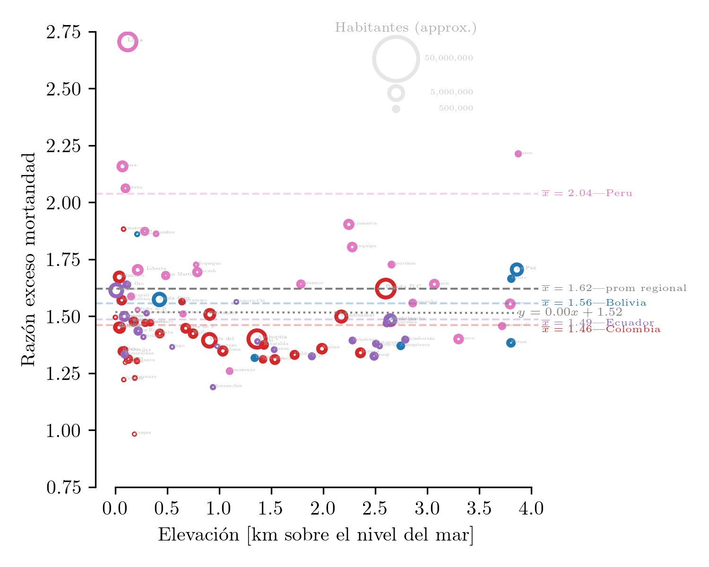
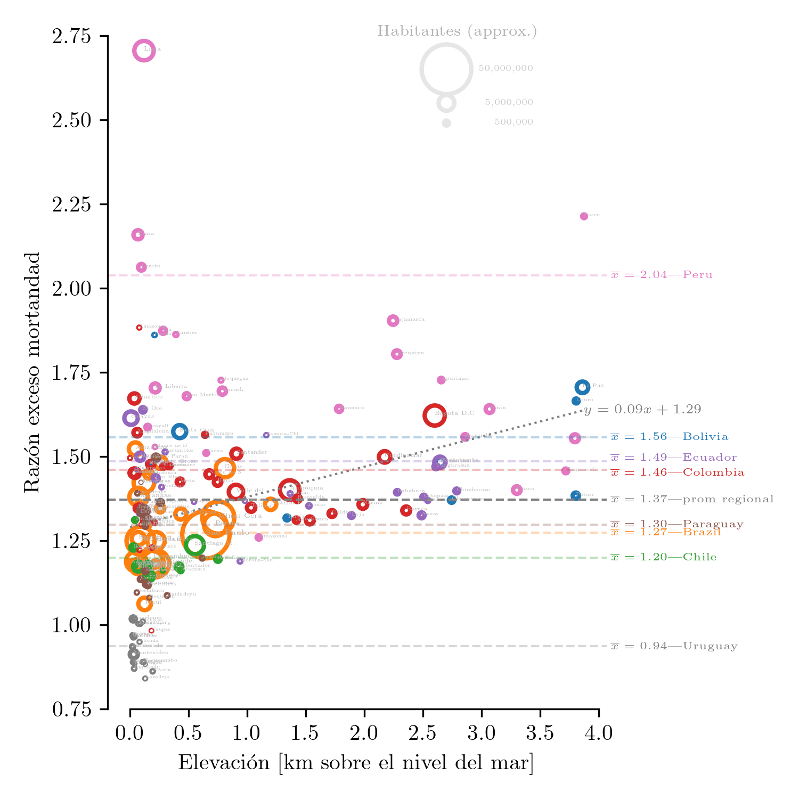
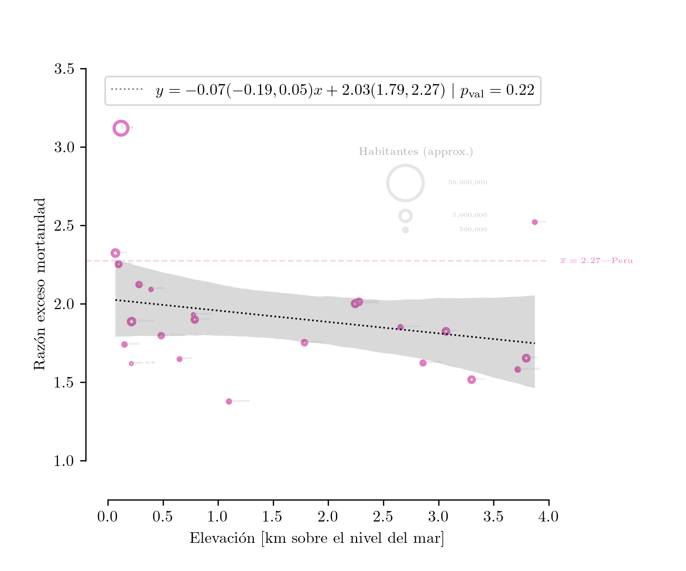
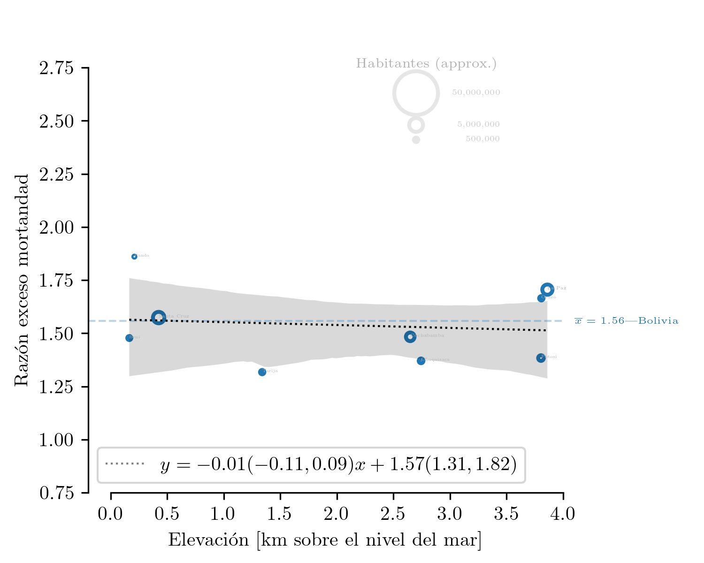
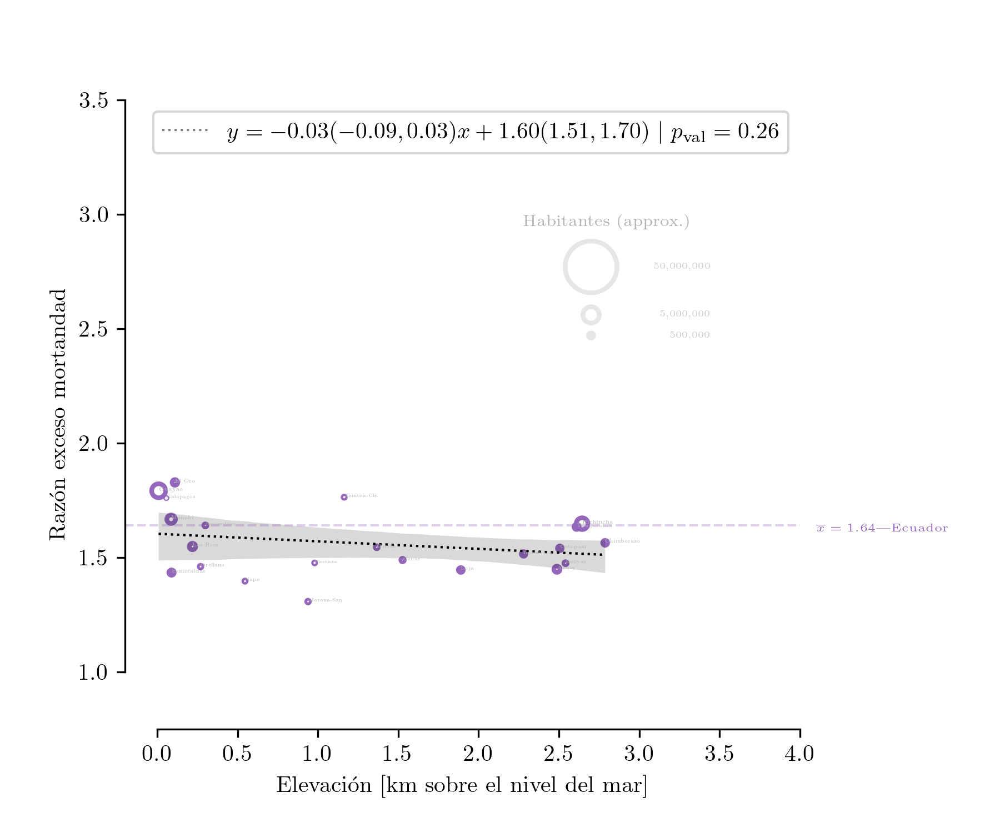
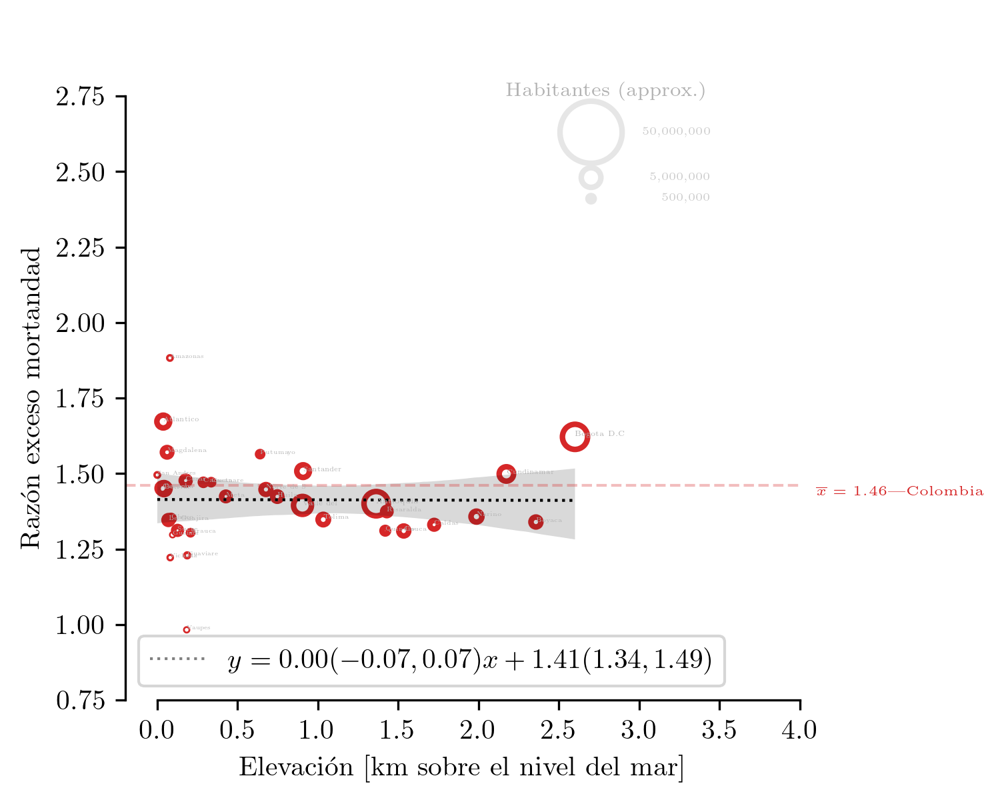
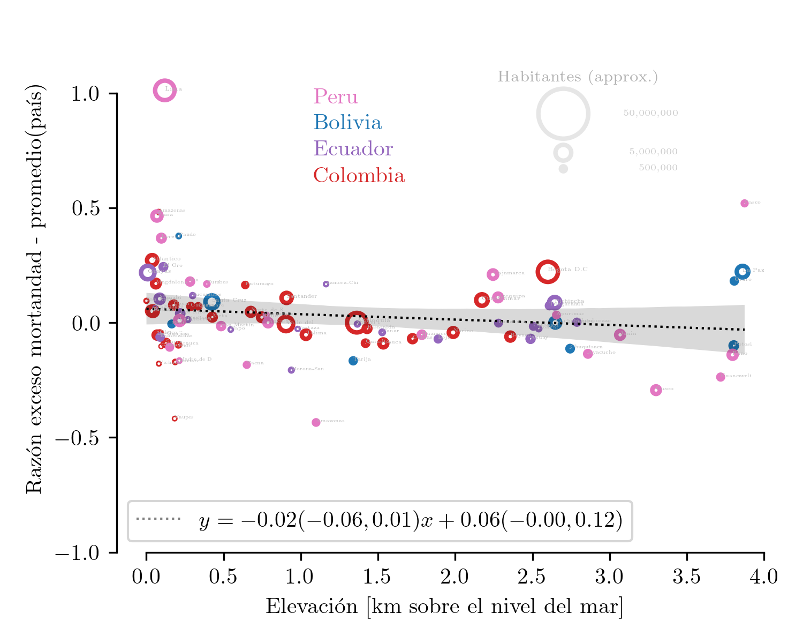
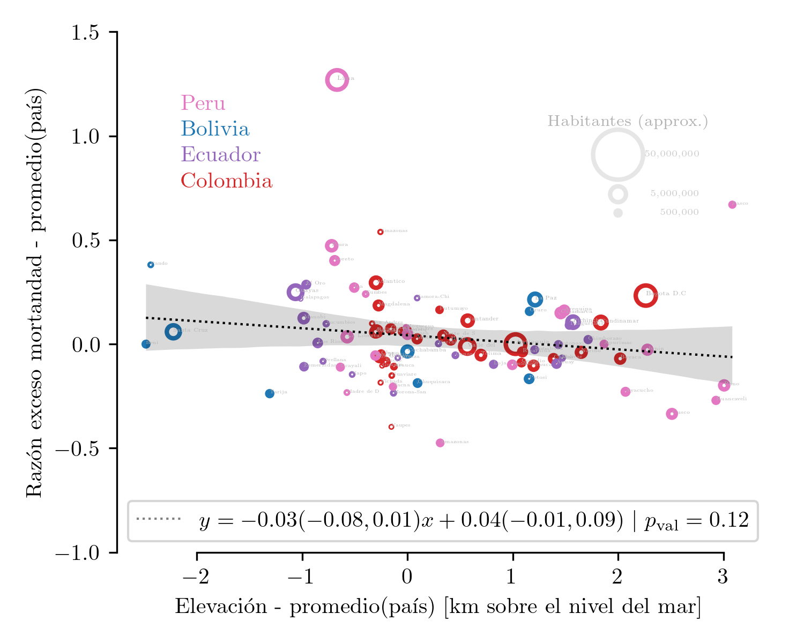

# Razón de mortandad vs elevación

## Descripción

### Países Andinos

(version [pdf]('reg_alt_alt.pdf'))  
Razón de excesos de mortandad ($R_m$) vs elevación para regiones administrativas (nivel 1) de ciertos países de Latinoamérica. 
La línea base de mortandad (denominador) se tomó utilizando el año 2019. 
El numerador son los datos de mortandad disponibles desde marzo 2020. 
El área de cada circulo es proporcional a la población de la región.  
Las líneas discontinuas marcan el promedio ponderado para cada país (y para la región).
La línea punteada marca la regresión lineal (no ponderada) de la razón de mortandad (y) vs la elevación (x). 
La elevación de cada región se obtuvo mediante el promedio ponderado (por población) de sus ciudades constituyentes.


```python
from IPython import display; display.Image("reg_alt_alt.png")
```


    

    


### Países sudamericanos


```python
display.Image("reg_alt.png")
```


    

    


(version [pdf]('reg_alt.pdf'))  
Similar al anterior pero con Paraguay, Brasil, Chile y Uruguay incluídos. Probablemente el resultado de la regresión es un caso de "falacia ecológica" 

## Países andinos individuales

Individualmente la pendiente de la regresión es negativa para los países andinos, sin embargo en el rango 0.025-.975 dan valores positivos y negativos para todos


```python
display.Image("reg_alt_altPeru.png")
```


    

    


```python
display.Image("reg_alt_altBolivia.png")
```


    

    


```python
display.Image("reg_alt_altEcuador.png")
```


    

    


```python
display.Image("reg_alt_altColombia.png")
```


    

    


## Países andinos "normalizados"

Si a la razón de mortandad le sustraemos el promedio de cada país obtenemos un aproximado que toma en cuenta los diferencias de cada país y se enfoca en la pendiente como función de la altura. El resultado es $m=-0.02(-0.06,0.01)$. Esto nos indica que por cada kilometro que se sube en altura, la razón de exceso de mortandad reduce un aprox. de 2%. La variación es mínima y además dentro del rango acotado se encuentran valores positivos y negativos 


```python
display.Image("reg_alt_alt_corr.png")
```


    

    


### normalizando la elevación

Finalmente, con el objetivo de reducir la "falacica ecológica" también podemos sustrar el promedio de altura de cada país


```python
display.Image("reg_alt_alt_corr_corr.png")
```


    

    


## Comentarios
1. Desde el principios de 2020 los habitantes de Lima han casi triplicado sus probabilidades de morir.
1. Uruguay es un caso excepcional en que las probabilidades han disminuido con la pandemia
1. La regresión para la segunda figura es "ingenua" en el sentido que no toma en cuenta que los países que han afrontado mejor la pandemia (e.g. Uruguay, Chile) tienen sus regiones a casi nivel del mar
1. Por ende, si tomamos en cuenta solo países con regions altas y bajas (Perú, Bolivia, Ecuador, Colombia) tenemos una mejor idea (primera figura)

## Fuentes
datos de covid obtenidos del gran trabajo de:
  - https://github.com/pr0nstar
      - https://github.com/pr0nstar/covid19-data
        - https://github.com/pr0nstar/covid19-data/blob/master/raw/mortality/south.america.subnational.mortality.csv  

información demográfica obtenidad de wolfram alpha

## Extra 


```python
!jupyter-nbconvert --to markdown README.ipynb
```

    [NbConvertApp] Converting notebook README.ipynb to markdown
    [NbConvertApp] Support files will be in README_files/
    [NbConvertApp] Making directory README_files
    [NbConvertApp] Making directory README_files
    [NbConvertApp] Making directory README_files
    [NbConvertApp] Making directory README_files
    [NbConvertApp] Making directory README_files
    [NbConvertApp] Making directory README_files
    [NbConvertApp] Making directory README_files
    [NbConvertApp] Making directory README_files
    [NbConvertApp] Writing 4970 bytes to README.md


```python
!echo 'gsh'; git add .; git commit -m'from mac'; git push
```

    gsh
    [master f0440e1] from mac
     11 files changed, 1488 insertions(+), 531 deletions(-)
     rewrite README_files/README_16_0.png (76%)
     create mode 100644 README_files/README_19_0.png
     rewrite reg_alt_alt_corr.png (76%)
     create mode 100644 reg_alt_alt_corr_corr.pdf
     create mode 100644 reg_alt_alt_corr_corr.png
     rewrite region_alt-Copy1.ipynb (90%)
     create mode 100644 region_alt_corr_country-Copy1.ipynb
    Enumerating objects: 20, done.
    Counting objects: 100% (20/20), done.
    Delta compression using up to 8 threads
    Compressing objects: 100% (12/12), done.
    Writing objects: 100% (12/12), 1.38 MiB | 765.00 KiB/s, done.
    Total 12 (delta 6), reused 0 (delta 0), pack-reused 0
    remote: Resolving deltas: 100% (6/6), completed with 6 local objects.
    To https://github.com/daliagachc/cov-alt.git
       a3d4626..f0440e1  master -> master


```python

```


```python

```


```python

```
