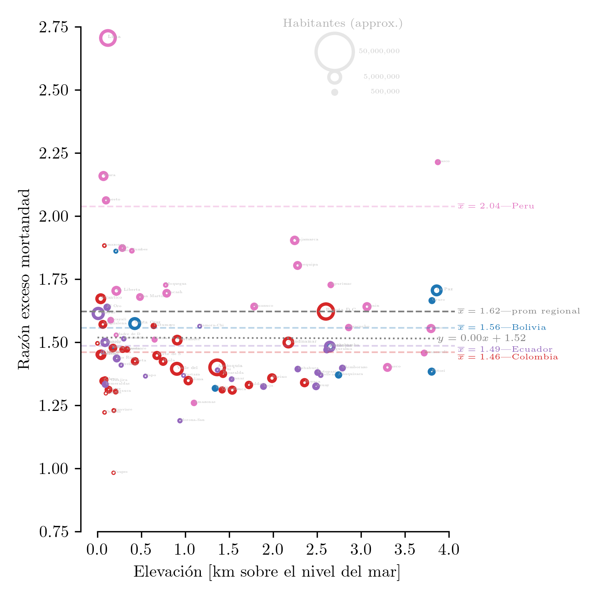

# Razón de mortandad vs elevación

## Descripción

### Países Andinos


```python
from IPython import display; display.Image("reg_alt_alt.png")
```


    

    


(version [pdf]('reg_alt_alt.pdf'))  
Razón de excesos de mortandad ($R_m$) vs elevación para regiones administrativas (nivel 1) de ciertos países de Latinoamérica. 
La línea base de mortandad (denominador) se tomó utilizando el año 2019. 
El numerador son los datos de mortandad disponibles desde marzo 2020. 
El área de cada circulo es proporcional a la población de la región.  
Las líneas discontinuas marcan el promedio ponderado para cada país (y para la región).
La línea punteada marca la regresión lineal (no ponderada) de la razón de mortandad (y) vs la elevación (x). 
La elevación de cada región se obtuvo mediante el promedio ponderado (por población) de sus ciudades constituyentes.

### Países sudamericanos


```python
display.Image("reg_alt.png")
```


    

    


(version [pdf]('reg_alt.pdf'))  
Similar al anterior pero con Paraguay, Brasil, Chile y Uruguay incluídos.

## Comentarios
1. Desde el principios de 2020 los habitantes de Lima han casi triplicado sus probabilidades de morir.
1. Uruguay es un caso excepcional en que las probabilidades han disminuido con la pandemia
1. La regresión para la segunda figura es "ingenua" en el sentido que no toma en cuenta que los países que han afrontado mejor la pandemia (e.g. Uruguay, Chile) tienen sus regiones a casi nivel del mar
1. Por ende, si tomamos en cuenta solo países con regions altas y bajas (Perú, Bolivia, Ecuador, Colombia) tenemos una mejor idea (primera figura)

## Fuentes
datos de covid obtenidos del gran trabajo de:
  - https://github.com/pr0nstar
      - https://github.com/pr0nstar/covid19-data
        - https://github.com/pr0nstar/covid19-data/blob/master/raw/mortality/south.america.subnational.mortality.csv  

información demográfica obtenidad de wolfram alpha

## Extra 


```python
!jupyter-nbconvert --to markdown README.ipynb
```

    [NbConvertApp] Converting notebook README.ipynb to markdown
    [NbConvertApp] Support files will be in README_files/
    [NbConvertApp] Making directory README_files
    [NbConvertApp] Making directory README_files
    [NbConvertApp] Writing 2311 bytes to README.md


```python

```
